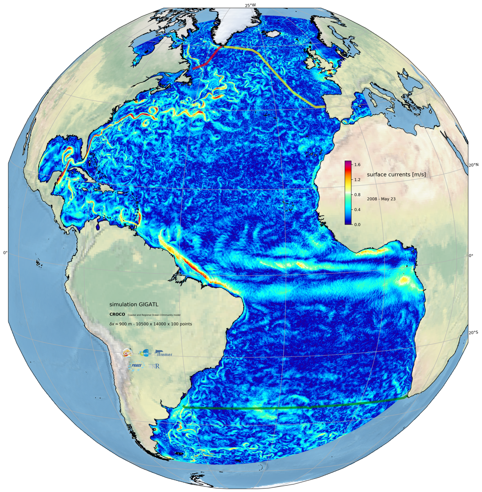

# GIGATL

## What is it?

GIGATL is a set of Atlantic Ocean numerical simulations performed with the Coastal and Regional Ocean COmmunity model ([CROCO](https://www.croco-ocean.org/)), which is built upon the Regional Oceanic Modeling System (ROMS).

## Contributors

Main contributors for the setup of the configuration, production of the simulations, management of the output data, and design of the post-processing tools:

 - Jonathan Gula (LOPS/UBO)
 - Sébastien Theetten (LOPS/Ifremer)
 - Gildas Cambon (LOPS/IRD)
 - Guillaume Roullet (LOPS/UBO)

With help from Patrick Marchesiello (LEGOS/IRD) for implementing new options in CROCO, and many others to come for the exploitation and validation of the model data.

We acknowledge PRACE and GENCI for awarding us access to HPC resources Joliot-Curie Rome and SKL from GENCI-TGCC (Grants 2020-A0090112051, 2019gch0401 and PRACE project 2018194735) and HPC facilities DATARMOR of “Pôle de Calcul Intensif pour la Mer” at Ifremer Brest France. 

## List of the main experiments

The simulation domain covers the Atlantic Ocean. Simulations are available in several resolutions:

 - **GIGATL1** =  < 1 km in the horizontal with 100 "topography-following" vertical levels
 - **GIGATL3** = 3 km in the horizontal with 100 "topography-following" vertical levels
 - **GIGATL6** = 6 km in the horizontal with 50 "topography-following" vertical levels
 - **GIGATL24** = 24 km in the horizontal with 50 "topography-following" vertical levels

with different types of forcings (including tides or not, hourly winds or daily winds), in particular:

 - GIGATL1_1h: *hourly winds*
 - GIGATL1_1h\_tides: *hourly winds and tides*
 - GIGATL3_1h: *hourly winds*
 - GIGATL3_1h\_tides: *hourly winds and tides*
 - GIGATL6_1h: *hourly winds*
 - GIGATL6_1h\_tides: *hourly winds and tides*

## Model Configuration

The simulations use the Coastal and Regional Ocean COmmunity model (CROCO, [https://www.croco-ocean.org/][croco]), which is based on the Regional Ocean Modeling System (ROMS).

  [croco]: https://www.croco-ocean.org/
  
The GIGATL24, GIGATL6, and GIGATL3 simulations are initialized in January 2004. The initial and boundary conditions are supplied by the Simple Ocean Data Assimilation (SODA). 

The GIGATL1 simulations are initialized in July 2007 using outputs from the GIGATL3 simulations. The boundary conditions are supplied by SODA. 

All simulations are forced by hourly atmospheric forcings from the Climate Forecast System Reanalysis (CFSR) using a bulk formulation with relative winds.

Each simulation has been run in two versions including tides or not. Simulations with tides include barotropic tidal forcing at the boundaries and tidal potential and self attraction that are taken respectively from TPXO7.2 and GOT99.2b. 

The bathymetry is taken from the SRTM30plus dataset. 

The k-epsilon turbulence closure scheme is used to parameterize vertical mixing, and the Canuto A stability function formulation is applied. There is no explicit lateral diffusivity in the simulation. 

The effect of bottom friction is parameterized through a logarithmic law of the wall with a roughness length .

### Source code:

 - [GIGATL1_1h][sc00]
 - [GIGATL1_1h\_tides][sc01]
 
  [sc00]: ./Code/GIGATL1_1h
  [sc01]: ./Code/GIGATL1_1h_tides
  

 
## Description of outputs

### Periods:

GIGATL1 (no tides) = From 2007-07-12  to 2009-09-06       = 2.2 years

GIGATL1 ( &nbsp; &nbsp; tides) = From 2007-07-02  to 2009-09-05       = 2.2 years

GIGATL3 (no tides) = From 2004-01-01 to 2013-08-09         = 9.5 years

GIGATL3 ( &nbsp; &nbsp; tides) = From 2007-03-25 to 2012-08-19         = 5.5 years

GIGATL6 (many versions) = From 2004-01-01 to 2014-01-01 = 10 years

### Variables: 

## Data availability

Data are currently stored on the TGCC supercomputing center and/or at the Datarmor supercomputing center at Ifremer in Plouzané, France.

Regional extractions are available upon request (gula [ at ] univ-brest [ dot ] fr)

## Post-processing tools

GIGATL3/6 outputs and GIGATL1 regional extractions can be analyzed using standard matlab or python ROMS/CROCO routines. See for example [croco_visu][tools0]

  [tools0]: https://croco-ocean.gitlabpages.inria.fr/croco_doc/tutos/tutos.14.visu.python.html#
  
Example notebooks for the use of xarray/dask/xgcm are available for [Surface data][notebook_0] or [3D data][notebook_1].

  [notebook_0]: ./notebooks/croco_surf_example_xgcm.ipynb
  [notebook_1]: ./notebooks/croco_3d_example_xgcm.ipynb

Specific python tools are developed for the (massively parallel) analysis of GIGATL1 outputs on HPC clusters: [paragridded][tools1]

  [tools1]: https://github.com/pvthinker/paragridded

## Validation and diagnostics

## Publications using GIGATL data

- Uchida, T., J. Le Sommer, C. Stern, R.P. Abernathey, C. Holdgraf, A. Albert, L. Brodeau, E. Chassignet, X. Xu, J. Gula, G. Roullet, Q. Wang, N. Koldunov, S. Danilov, D. Menemenlis, C. Bricaud, B. Arbic, A. Biastoch, R. Schubert, F. Qiao, B, Xiao, B. Fox-Kemper, & W.K. Dewar : Cloud-based framework for inter-comparing submesoscale permitting realistic ocean models, submitted. 

- Mashayek, A., J. Gula, L. Baker, L. Cimoli, A. Naveira Garabato & J. Riley : Mountains to climb : on the role of seamounts in the ascent of deep ocean waters, submitted. https ://doi.org/10.21203/rs.3.rs- 939198/v1.

- Vic, C., S. Hascoet, J. Gula, T. Huck, & C. Maes, **2022** : Oceanic mesoscale cyclones cluster surface Lagrangian material, Geophys. Res. Lett.

- Ruan, X., J. Wenegrat & J. Gula, **2021** : Slippery bottom boundary layers and the loss of energy from the general circulation by the bottom drag, Geophys. Res. Lett., https://doi.org/10.1029/2021GL094434

- Barkan, R., K. Srinivasan, L. Yang, J.C. McWilliams, J. Gula & C. Vic, **2021** : Oceanic mesoscale eddy depletion catalyzed by internal waves, Geophys. Res. Lett., https ://doi.org/10.1029/2021GL094376

- Qu L., L.N. Thomas & J. Gula, **2021** : Bottom mixing enhanced by storm-generated near-inertial waves in Straits of Florida, Geophys. Res. Lett., 48, e2021GL093773.

## DOI

The latest release has been archived on zenodo:

## License

