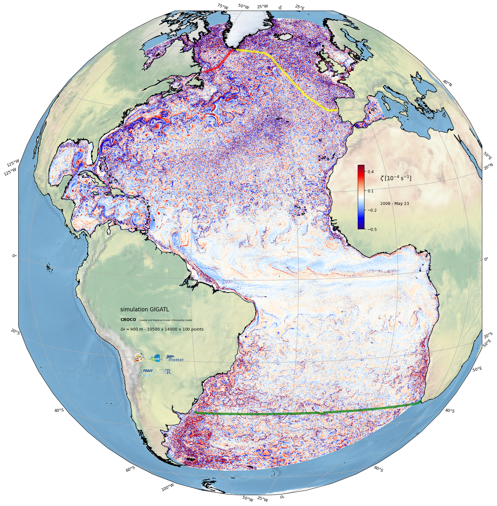

# GIGATL

## What is it?

GIGATL is a set of Atlantic Ocean numerical simulations performed with the Coastal and Regional Ocean COmmunity model ([CROCO](https://www.croco-ocean.org/)), which is built upon the Regional Oceanic Modeling System (ROMS).

The simulation domain covers the Atlantic Ocean. Simulations are available in several resolutions:

 - **GIGATL1** =  < 1 km in the horizontal with 100 "topography-following" vertical levels
 - **GIGATL3** = 3 km in the horizontal with 100 "topography-following" vertical levels
 - **GIGATL6** = 6 km in the horizontal with 50 "topography-following" vertical levels
 - **GIGATL24** = 24 km in the horizontal with 50 "topography-following" vertical levels

with different types of forcings (including tides or not, hourly winds or daily winds).

## Model Configuration

The GIGATL24, GIGATL6, and GIGATL3 simulations are initialized in January 2004. The initial and boundary conditions are supplied by the Simple Ocean Data Assimilation (SODA). 

The GIGATL1 simulations are initialized in July 2007 using outputs from the GIGATL3 simulations. The boundary conditions are supplied by SODA. 

All simulations are forced by hourly atmospheric forcings from the Climate Forecast System Reanalysis (CFSR) using a bulk formulation with relative winds.

Each simulation has been run in two versions including tides or not. Simulations with tides include barotropic tidal forcing at the boundaries and tidal potential and self attraction that are taken respectively from TPXO7.2 and GOT99.2b. 

The bathymetry is taken from the SRTM30plus dataset. 

The k-epsilon turbulence closure scheme is used to parameterize vertical mixing, and the Canuto A stability function formulation is applied. There is no explicit lateral diffusivity in the simulation. 

The effect of bottom friction is parameterized through a logarithmic law of the wall with a roughness length .

**Source code for:**

 - [GIGATL1_1h][sc00]
 - [GIGATL1_1h\_tides][sc01]
 
  [sc00]: ./Code/GIGATL1_1h
  [sc01]: ./Code/GIGATL1_1h_tides
  
## List of the main experiments

 - GIGATL1_1h
 - GIGATL1_1h\_tides
 - GIGATL3_1h
 - GIGATL3_1h\_tides
 - GIGATL6_1h
 - GIGATL6_1h\_tides
 
## Description of outputs

## Validation and diagnostics

## Publications using GIGATL data

- Qu L., L.N. Thomas & J. Gula : Bottom mixing enhanced by storm-generated near-inertial waves in Straits of Florida, in rev. for Geophys. Res. Lett.
- Barkan, R., K. Srinivasan, L. Yang, J.C. McWilliams, J. Gula & C. Vic : Oceanic mesoscale eddy depletion catalyzed by internal waves, submitted.
- Ruan, X., J. Wenegrat & J. Gula : Slippery bottom boundary layers and the loss of energy from the general circulation by the bottom drag, submitted.

## License

